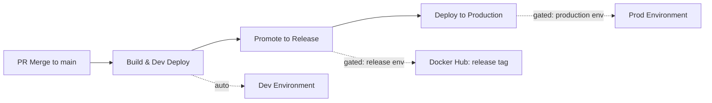

# MiniURL API - High-Throughput URL Shortener (Microservices)

MiniURL is a scalable, high-performance URL shortening system migrated from a monolith to a microservices architecture. It is designed to handle high throughput (targeting ~10k redirects/sec) using a reactive redirect path, distributed caching, and an event-driven architecture.

## Architecture Overview

The system is split into several specialized services to ensure independent scalability and fault isolation.

### Service Map
- **API Gateway**: The single entry point. Handles routing, RS256 JWT validation (via JWKS), and Redis-backed distributed rate limiting.
- **Identity Service**: Manages users, authentication, and RSA key pairs for asymmetric JWT signing. OTP codes and email verification state are stored in Redis (not the database).
- **URL Service**: Handles URL creation, management, and generates collision-free short codes using Snowflake IDs.
- **Redirect Service**: A dedicated **Reactive (WebFlux)** service optimized for the "hot path" (`/r/{code}`). Uses a "Redis-first" resolution strategy.
- **Feature Service**: Manages global and user-specific feature flags with Redis caching.
- **Notification Service**: Asynchronous worker that consumes events from Kafka to send emails.
- **Analytics Service**: Asynchronous worker that consumes click events from Kafka to persist analytics data.
- **Eureka Server**: Provides service discovery for all microservices.

### Key Design Patterns
- **Asymmetric Security**: Uses **RS256**. The Identity Service signs tokens with a private key; the Gateway validates them using a public key fetched via a JWKS endpoint.
- **Event-Driven Communication**: Uses **Apache Kafka** for non-blocking operations (Notifications, Analytics).
- **Reliability**: Implements the **Outbox Pattern** in Identity and URL services to ensure atomic database updates and guaranteed event delivery.
- **High Throughput**: The Redirect Service uses non-blocking I/O (Spring WebFlux) and Redis to minimize latency.
- **Database per Service**: Physical separation of MySQL databases to prevent coupling and allow independent scaling.
- **Redis-First OTP**: Login OTP codes are stored in Redis with a 5-minute TTL instead of the database, reducing DB writes and leveraging Redis auto-expiry for cleanup.

---

## Tech Stack

- **Backend**: Java 21, Spring Boot 3.2.0, Spring Cloud 2023.0.0
- **Reactive Stack**: Spring WebFlux (Redirect Service)
- **Service Discovery**: Netflix Eureka
- **API Gateway**: Spring Cloud Gateway
- **Messaging**: Apache Kafka
- **Caching/Rate Limiting**: Redis
- **Databases**: MySQL (Multiple instances)
- **Observability**: OpenTelemetry, Micrometer, Prometheus, Grafana
- **Deployment**: Kubernetes, Helm, Docker, GitHub Actions

---

## Getting Started

### Prerequisites
- **JDK 21** or higher
- **Maven 3.8+**
- **Docker & Docker Compose**
- **kubectl** + **Helm 3.14+** (for Kubernetes deployment)
- **Minikube** (optional, for local K8s testing)

### 1. Local Development (Docker Compose)

```bash
docker compose up -d
```

Starts all 8 services plus Kafka, Zookeeper, Redis, MySQL, Prometheus, and Grafana.

### 2. Build the Project

```bash
mvn clean install -DskipTests
```

### 3. Running Individual Services

**Order of startup:**
1. `eureka-server`
2. `identity-service`, `url-service`, `feature-service`
3. `api-gateway`, `redirect-service`
4. `notification-service`, `analytics-service`

```bash
mvn spring-boot:run -pl identity-service
```

### 4. Local Kubernetes (Minikube)

```bash
# 1. Start Minikube
./scripts/local/minikube-start.sh

# 2. Build all service images inside Minikube
./scripts/local/minikube-build-images.sh

# 3. Deploy via Helm
./scripts/local/minikube-deploy.sh

# 4. Smoke test
./scripts/local/minikube-smoke-test.sh
```

See [Local Minikube Development](docs/development/local-minikube.md) for the full guide.

### 5. Kubernetes Deployment (Helm)

MiniURL is deployed via a **Helm chart** ([`helm/miniurl/`](helm/miniurl/)) — the single source of truth for all Kubernetes resources.

| Environment | Values File | Notes |
|-------------|-------------|-------|
| **Minikube (local)** | `values-local.yaml` | `pullPolicy: Never`, local images |
| **Development** | `values-dev.yaml` | CI auto-deploy on push to main |
| **Home Server (K3s)** | `values-home.yaml` | Traefik ingress, ServiceLB, self-hosted runner |
| **Production** | `values-prod.yaml` | NGINX ingress, HPA, RollingUpdate deployment |

```bash
# Example: deploy to dev with per-service image tags
helm upgrade --install miniurl ./helm/miniurl \
  --values ./helm/miniurl/values-dev.yaml \
  --set services.identity-service.image.tag=identity-service-dev-abc12345 \
  --namespace miniurl --create-namespace --wait --atomic
```

All CI deploys use immutable image tags (`{service}-dev-{sha}` or `{service}-release-{version}`) — mutable tags like `latest` are never used in deployed environments.

---

## CI/CD Pipeline

The project uses a **three-stage image promotion pipeline** with approval gates:



| Workflow | Trigger | Runner | Purpose |
|----------|---------|--------|---------|
| [PR Validation](.github/workflows/pr-validation.yml) | Pull request | `ubuntu-latest` | Build, test, Helm lint, template validation |
| [Build and Dev Deploy](.github/workflows/build-and-dev-deploy.yml) | Push to main | Build: `ubuntu-latest` / Deploy: `[self-hosted, home-server]` | Detect changed services, build dev images, deploy to K3s dev |
| [Promote to Release](.github/workflows/promote-to-release.yml) | Manual (gated) | `ubuntu-latest` | Tag dev images as release with approval from `release` environment |
| [Deploy to Production](.github/workflows/deploy-to-production.yml) | Manual (gated) | `[self-hosted, home-server]` | Deploy release images to prod with approval from `production` environment |
| [Rollback](.github/workflows/rollback.yml) | Manual | `[self-hosted, home-server]` | `helm rollback` with verification |
| [Bootstrap Environment](.github/workflows/bootstrap-environment.yml) | Manual | `[self-hosted, home-server]` | Provision namespace, secrets, infra, deploy |

### Image Promotion Flow

| Stage | Image Tag Format | Registry | Trigger | Approval |
|-------|-----------------|----------|---------|----------|
| **Dev Build** | `{service}-dev-{short_sha}` | Docker Hub | PR merged to main | None (auto) |
| **Release Promotion** | `{service}-release-{version}` | Docker Hub | Manual workflow | GitHub Environment: `release` |
| **Production Deploy** | Uses release tag | Docker Hub (already there) | Manual workflow | GitHub Environment: `production` |

**Key principle**: The same container image that runs in dev is promoted to production — no rebuild, no risk of build inconsistency.

### Change Detection

Only changed services are built and deployed. The [`build-and-dev-deploy.yml`](.github/workflows/build-and-dev-deploy.yml) workflow uses `git diff` to detect which services changed:

- Changes to `identity-service/*` → only identity-service is built and deployed
- Changes to `common/*`, `pom.xml`, or `Dockerfile` → all 8 services are built and deployed
- Changes to `README.md`, `SETUP_GUIDE.md`, `docs/**` → no build triggered

### State Files

The pipeline uses Git-tracked state files to track image promotion status:

| File | Purpose | Updated By |
|------|---------|------------|
| [`image-tags-dev.yaml`](image-tags-dev.yaml) | Latest dev image tags per service | `build-and-dev-deploy.yml` |
| [`pending-releases.yaml`](pending-releases.yaml) | Services awaiting release promotion | `build-and-dev-deploy.yml` |
| [`release-tags.yaml`](release-tags.yaml) | Released image tags with version | `promote-to-release.yml` |
| [`prod-deployments.yaml`](prod-deployments.yaml) | Production deployment history | `deploy-to-production.yml` |

The **self-hosted runner** on the home server connects **outbound** to GitHub via WebSocket — no inbound SSH or webhook ports needed. See [Home Server K3s Guide](docs/deployment/home-server-k3s.md) for setup.

---

## Security Architecture

The system uses **RS256 (Asymmetric)** JWTs for secure, stateless authentication.

1. **Token Issuance**: `identity-service` generates a key pair and signs JWTs using the **Private Key**.
2. **Public Key Distribution**: `identity-service` exposes a `/.well-known/jwks.json` endpoint containing the **Public Key**.
3. **Token Validation**: `api-gateway` fetches the public key from the JWKS endpoint and validates incoming tokens without calling the Identity Service for every request.

Secrets are managed via Kubernetes Secrets — never stored in values files or committed to the repository. CI/CD workflows inject secrets at deploy time from GitHub Environment secrets.

---

## Observability

- **Distributed Tracing**: Integrated via **OpenTelemetry**. Every request is tracked across services using a unique Trace ID.
- **Metrics**: Exposed via **Prometheus** endpoints (`/actuator/prometheus`) in every service.
- **Dashboards**: Grafana dashboards in `deploy/monitoring/dashboards/`.

---

## API Reference (via Gateway)

All requests should be sent to the **API Gateway** (default port `8080`).

### Public Endpoints
- `GET /r/{code}` → Redirects to original URL (handled by Redirect Service)
- `POST /api/auth/signup` → User registration
- `POST /api/auth/login` → Authentication (password + OTP via Redis)
- `POST /api/auth/verify-otp` → Verify OTP and receive JWT
- `POST /api/auth/resend-otp` → Resend OTP (30s cooldown)
- `GET /api/features/global` → Get global feature flags

### Authenticated Endpoints
- `POST /api/urls` → Create short URL
- `GET /api/urls` → List user's URLs
- `DELETE /api/urls/{id}` → Delete a URL
- `PUT /api/users/profile` → Update profile

### Admin Endpoints
- `POST /api/admin/invites` → Send email invitation
- `GET /api/admin/users` → Manage all users
- `POST /api/admin/features` → Manage feature flags

---

## Project Structure

```text
.
├── common/                     # Shared DTOs, Exceptions, and Utils
├── api-gateway/                # Spring Cloud Gateway (Routing, Security, Rate Limiting)
├── eureka-server/              # Service Discovery
├── identity-service/           # Auth, User Management, JWKS, Redis-backed OTP
├── url-service/                # URL Management, Snowflake ID Generation
├── redirect-service/           # Reactive Redirect Path (High Throughput)
├── feature-service/            # Feature Flag Management
├── notification-service/       # Async Email Worker (Kafka Consumer)
├── analytics-service/          # Click Tracking Worker (Kafka Consumer)
├── helm/miniurl/               # Helm Chart (single source of truth for K8s)
├── .github/workflows/          # CI/CD Pipelines (6 workflows)
├── scripts/
│   ├── local/                  # Minikube dev scripts
│   └── deploy/                 # Deployment & smoke-test scripts
├── docs/
│   ├── deployment/             # Home server K3s, CI/CD, bootstrap guides
│   └── development/            # Local Minikube guide
├── k8s/                        # Infrastructure manifests (Prometheus, Grafana) + deprecated
├── terraform/                  # Infrastructure as Code
├── image-tags-dev.yaml         # Dev image tags (auto-updated by CI)
├── pending-releases.yaml       # Pending release promotions (auto-updated)
├── release-tags.yaml           # Released image tags (promoted from dev)
├── prod-deployments.yaml       # Production deployment history
└── docker-compose.yml          # Local Development Environment
```

## Deployment Documentation

- [Home Server K3s Deployment](docs/deployment/home-server-k3s.md) — Self-hosted runner model, K3s setup, day-2 ops
- [Local Minikube Development](docs/development/local-minikube.md) — Full walkthrough, hybrid mode, troubleshooting
- [Initial Environment Bootstrap](docs/deployment/initial-bootstrap.md) — Provision a new environment from scratch
- [Release Process](docs/deployment/release-process.md) — Full release flow with image promotion
- [GitHub Actions Reference](docs/deployment/github-actions.md) — All 6 CI/CD workflows explained
- [Local Docker Compose](docs/deployment/local-docker-compose.md) — Feature development without K8s
