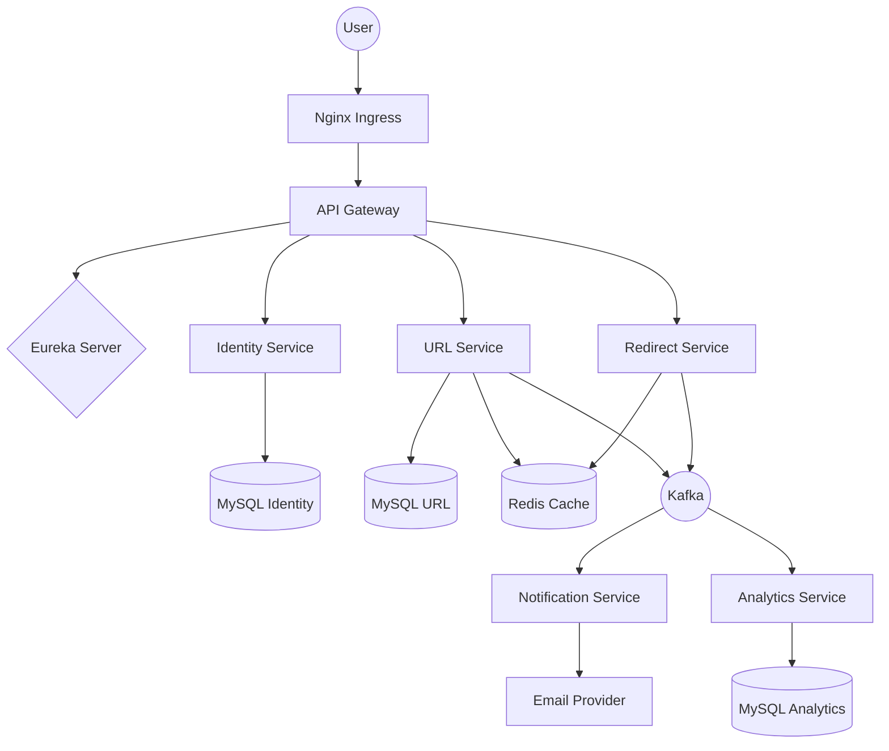

# Comprehensive Plan: Testing, CI/CD, and Kubernetes Deployment for MyURL

This document outlines the detailed strategy for implementing unit/integration testing, GitHub CI/CD pipelines, and Kubernetes deployment for the MyURL microservices project.

## 1. Unit Testing & Integration Testing Strategy

### 1.1 Unit Testing
**Goal:** Ensure individual components (business logic, utilities) function correctly in isolation.

- **Tools:** JUnit 5, Mockito, AssertJ.
- **Coverage Requirement:** Minimum 80% line coverage for `@Service` and `@Component` classes.
- **Focus Areas:**
    - `UrlService`: Validation logic, alias generation, limit checking.
    - `IdentityService`: JWT generation, password hashing, token validation.
    - `RedirectService`: URL lookup logic, event production.
    - `Common`: Utility classes (`JwtUtil`, `ValidationUtils`).
- **Approach:** Use Mockito to mock all external dependencies (Repositories, Kafka Producers, Redis Templates).

### 1.2 Integration Testing
**Goal:** Verify the interaction between the service and its real dependencies (Database, Cache, Message Broker).

- **Tools:** Spring Boot Test, Testcontainers.
- **Test Profiles:** `integration-test` (activates Testcontainers).
- **Infrastructure Strategy:** Use Testcontainers to spin up ephemeral instances of:
    - `mysql:8.0`
    - `redis:7.0`
    - `confluentinc/cp-kafka:latest`
- **Service-Specific Scenarios:**
    - **Identity Service:** User registration $\rightarrow$ DB persistence $\rightarrow$ Token generation.
    - **URL Service:** Create URL $\rightarrow$ DB save $\rightarrow$ Redis cache update $\rightarrow$ Kafka event emit.
    - **Redirect Service:** URL request $\rightarrow$ Redis lookup $\rightarrow$ Kafka click event emit.
    - **Notification Service:** Kafka event consume $\rightarrow$ Email template processing.
    - **Analytics Service:** Kafka event consume $\rightarrow$ Aggregation $\rightarrow$ DB save.

### 1.3 Test Profiles Summary
| Profile | Scope | Dependencies | Speed |
|---|---|---|---|
| `test` | Unit | Mocks | Fast |
| `integration-test` | Integration | Testcontainers (Real DB/Kafka/Redis) | Medium |
| `e2e-test` | End-to-End | Deployed K8s/Docker Compose environment | Slow |

---

## 2. GitHub CI/CD Pipeline

### 2.1 Workflow Design
We will implement two primary GitHub Actions workflows.

#### A. PR Validation (`pr-validation.yml`)
**Trigger:** Pull Request to `main`.
1. **Checkout Code**
2. **JDK Setup** (Java 17)
3. **Maven Build & Unit Tests:** `mvn clean test`
4. **Checkstyle/Linting** (Optional)

#### B. Main Pipeline (`main-pipeline.yml`)
**Trigger:** Merge to `main`.
1. **Checkout Code**
2. **JDK Setup**
3. **Build & Unit Tests:** `mvn clean test`
4. **Integration Tests:** `mvn verify -Pintegration-test` (Requires Docker for Testcontainers)
5. **Docker Build & Push:**
    - Build multi-stage images for all services.
    - Tag images with Git SHA and `latest`.
    - Push to Docker Hub/GHCR.
6. **K8s Deployment:**
    - Update image tags in K8s manifests.
    - Apply manifests via `kubectl apply`.

### 2.2 Docker Strategy
- **Multi-stage Builds:**
    - **Stage 1 (Build):** Maven image to compile and package JAR.
    - **Stage 2 (Runtime):** Eclipse Temurin JRE (slim) to run the JAR.
- **Tagging Strategy:**
    - `miniurl/<service>:<git-sha>` (Immutable, used for deployment)
    - `miniurl/<service>:latest` (Floating tag for latest stable)
    - `miniurl/<service>:v<version>` (For releases)

### 2.3 Secrets Management
- **GitHub Secrets:**
    - `DOCKER_USERNAME` / `DOCKER_PASSWORD`
    - `KUBE_CONFIG` (Base64 encoded)
    - `DB_PASSWORD` (for integration tests if not using Testcontainers)

---

## 3. Kubernetes Deployment Strategy

### 3.1 Architecture Overview
**Namespace:** `miniurl`

#### Component Mapping:
- **Ingress:** Nginx Ingress Controller $\rightarrow$ Routes `/api/**` to `api-gateway`.
- **API Gateway:** Entry point, handles rate limiting and security.
- **Eureka Server:** Service discovery for internal communication.
- **Microservices:** `identity`, `url`, `redirect`, `feature`, `notification`, `analytics`.
- **Infrastructure:** MySQL (StatefulSet), Redis (Deployment), Kafka (StatefulSet).

### 3.2 Technical Specifications
- **Service Discovery:** Services register with Eureka using the K8s internal DNS: `eureka-server.miniurl.svc.cluster.local`.
- **Configuration:**
    - `global-config` ConfigMap: Shared environment variables (e.g., `SPRING_PROFILES_ACTIVE=prod`).
    - `service-secrets` Secret: Sensitive data (DB passwords, JWT keys).
- **Storage:**
    - Persistent Volume Claims (PVCs) for MySQL data directories to ensure persistence across pod restarts.
- **Scaling & Reliability:**
    - **HPA:** Enabled for `redirect-service` and `api-gateway` (Target CPU 70%).
    - **Resource Limits:**
        - Requests: 256Mi RAM, 0.2 CPU.
        - Limits: 512Mi RAM, 0.5 CPU.
    - **Health Checks:**
        - Liveness Probe: `/actuator/health/liveness`
        - Readiness Probe: `/actuator/health/readiness`
- **Deployment Strategy:** `RollingUpdate` (maxSurge: 25%, maxUnavailable: 25%).

### 3.3 K8s Workflow Diagram

---

## 4. Update SETUP_GUIDE.md

### 4.1 New Section: Kubernetes Deployment
Step-by-step guide:
1. **Prerequisites:** Install `kubectl`, `helm`, and a K8s cluster (Minikube/EKS/GKE).
2. **Namespace Creation:** `kubectl create namespace miniurl`.
3. **Secrets Setup:** Instructions on creating the `service-secrets` secret.
4. **Infrastructure Deployment:** Applying `k8s/infrastructure/*.yaml`.
5. **Service Deployment:** Applying `k8s/services/*.yaml`.
6. **Verification:** Checking pod status and accessing the API via Ingress.

### 4.2 General Updates
- **Architecture:** Update "Local Development" to reflect the microservices structure instead of the monolith.
- **Troubleshooting:** Add a "Kubernetes Troubleshooting" section:
    - Pod `CrashLoopBackOff` $\rightarrow$ Check logs with `kubectl logs`.
    - Service connectivity $\rightarrow$ Check `kubectl get svc` and DNS.
    - Database connection $\rightarrow$ Verify PVCs and Secrets.
- **Observability:** Add instructions for:
    - Prometheus: Scraping `/actuator/prometheus`.
    - Grafana: Importing dashboards for Spring Boot.
    - ELK: Configuring Logstash to collect container logs.
